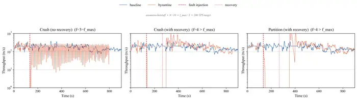
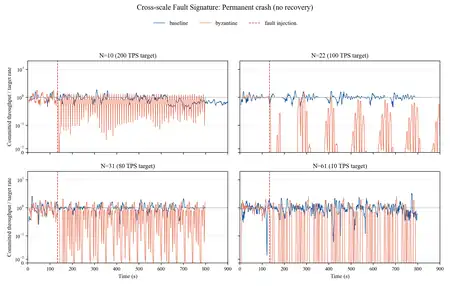

# STABL Benchmark — HotStuff 故障注入评测

这是一个基于 STABL / Diablo 的 Benchmark 集成与故障评测项目，用于在受控故障条件下评测现有的 2-chain HotStuff 实现。项目将 STABL / Diablo 的评测流程适配到 `asonnino-hotstuff`，区分 mempool 接收与共识提交，自动化执行本地多节点实验，并分析 crash、recovery 和 network partition 场景下的系统行为。

> 项目边界：本项目是在已有 Benchmark / Orchestration Framework 和已有共识实现基础上进行适配与扩展，**不声称从零实现 HotStuff 或 STABL**。

## 项目实现

- **为 `asonnino-hotstuff` 实现原生 Diablo Adapter**
  - 使用确定性的 9-byte interaction payload；
  - 通过 length-prefixed TCP 将 workload 提交到 Rust mempool；
  - 通过 Commit-Status Bridge 进行 HTTP polling；
  - mempool 成功接收后记录 `submit`，只有观察到对应的 consensus commit evidence 后才记录 `commit`。
- **在 Minion 中实现 fault-aware experiment lifecycle**
  - 永久 crash：`crash-no-recovery`；
  - crash 后恢复：`crash`；
  - 使用 Linux `tc/netem` 注入 network partition；
  - 为 N=10、N=22、N=31、N=61 实验提供可复现的 Docker topology 与 setup 配置。
- **结果分析与可视化**
  - 从 `results.json` 统计 planned / submitted / committed / aborted / error；
  - 计算 committed/submitted 与 committed/planned completion ratio；
  - 统计平均 commit latency 以及 P50 / P90 / P99；
  - 分析 submitted / committed throughput 随时间的变化，并提供面向 fault experiment 的绘图工具。

正式项目评测还包含 STABL 的 redundant-client Byzantine Node Tolerance 配置。该实验评测的是 secure-client fan-out 策略的开销与行为，不应被理解为保留了一组恶意 validator 行为实验。

## 系统流程

```text
Minion orchestrator
    |
    +-- 通过 SSH 部署 / 启动 / 停止 / 收集结果
    +-- 调度 crash / recovery / tc-netem fault
    |
Diablo Primary -> Diablo Secondaries
                     |
                     | deterministic payload
                     v
              asonnino adapter
                     |
                     | framed TCP
                     v
              HotStuff mempool
                     |
                     v
                 consensus
                     |
                     | committed-batch evidence
                     v
            Commit-Status Bridge
                     |
                     | HTTP status polling
                     v
              Diablo result events
                     |
                     v
          analysis / plots / summaries
```

这里最重要的 measurement boundary 是：一次成功的 socket write 只证明请求已经进入 **mempool admission**，并不等价于 **consensus commitment**。

## 代表性评测结果

### N=10 Threshold Fault Suite

下图展示 N=10 配置下 baseline 与 permanent crash、recoverable crash、network partition 的 committed-throughput trace。故障注入与恢复时刻在图中显式标记，可以直接观察 fault window 内的停滞、退化以及恢复后的 catch-up 行为。



### 跨规模 Permanent Crash

下图将 N=10 / N=22 / N=31 / N=61 在各自 operating point 下的 committed throughput / target rate 归一化，用于观察 permanent crash 后是否出现可重复的 degradation pattern。由于不同规模使用的 target TPS 与 client policy 不完全相同，这组结果用于比较 fault-response shape，而不是作为严格的单变量 scalability ranking。



> 展示图来自项目实验 evidence，仅做尺寸与格式压缩以适合 GitHub README；图中实验数据未修改。更完整的实验配置、运行命令与结果分析流程见 [`docs/RUNBOOK.md`](docs/RUNBOOK.md)。

## 仓库结构与贡献边界

| 路径 | 作用 | 本项目相关改动 |
| --- | --- | --- |
| `minion/` | STABL 实验编排 | deployment adapter、fault lifecycle、Observer 集成、不同规模的 setup / compose 配置、分析与绘图工具 |
| `diablo/` | 分布式 workload 生成 | `nasonninohotstuff` adapter 与 commit-status 集成 |
| `asonnino-hotstuff/` | 现有 Rust 2-chain HotStuff 实现 | 少量 Benchmark / fault enablement 改动；共识协议本身属于 upstream 实现 |
| `hotstuff/` | 现有 Go HotStuff 实现 | 面向 Benchmark 的集成与修复；协议实现本身属于 upstream 工作 |
| `docker-compose.yml` | 本地 N=10 实验拓扑 | chain / client / builder / runner 网络 |
| `docs/RUNBOOK.md` | 历史实验 runbook | 开发与评测期间使用的命令、排障记录和实验观察 |

四个组件目录均通过 Git submodule 固定到特定版本。为了获得与本项目一致的集成状态，请使用递归方式 clone。

## 复现本地环境

前置条件：Linux（或 Linux VM）、Docker + Compose plugin、Git、OpenSSH client。

```bash
git clone --recurse-submodules https://github.com/ultrabababa/stabl-benchmark.git
cd stabl-benchmark
git submodule update --init --recursive
```

生成仅用于 Benchmark Docker 网络内部通信的本地 SSH key pair。私钥和公钥均已通过 `.gitignore` 排除，不应提交到仓库。

```bash
ssh-keygen -t ed25519 -N '' -f stabl_key
chmod 600 stabl_key
```

由于 runner image 基于 `stabl-node:latest`，需要按顺序构建：

```bash
docker build -t stabl-node:latest -f Dockerfile .
docker build -t stabl-runner:latest -f Dockerfile.runner .
```

启动仓库根目录下的 N=10 topology：

```bash
docker compose up -d --no-build
docker compose ps
```

N=22 / N=31 / N=61 的扩展 topology、Benchmark 命令、fault run 示例、排障记录和分析命令保留在 [`docs/RUNBOOK.md`](docs/RUNBOOK.md) 中。

典型结果分析从 Minion submodule 中执行：

```bash
cd minion
python3 analyze_results.py <result-archive.results.tar.gz>
```

## 实验范围与限制

项目在 N=10、N=22、N=31、N=61 的本地 Docker 环境中，以不同规模对应的 operating point 执行了受控实验。Fault run 包括 permanent crash、recoverable crash 与 network partition；分析重点是 delivered work、latency distribution 以及 fault 后 degradation / recovery 的变化，而不仅是无故障条件下的峰值 throughput。

需要注意以下限制：

- 实验运行于单台主机 / VM 上的 Docker 网络，而不是每个 validator 独占一台物理机或云主机；
- 较大 committee 会受到宿主机与网络容量影响，例如 socket pressure 和 neighbor-table pressure；
- N=31 / N=61 使用了比小规模配置更保守的 mempool-selection policy，因此跨规模结果不是严格的单变量 scalability benchmark；
- workload 使用较小的 synthetic payload，不覆盖真实应用执行与 state growth；
- 正式评测中每个 configuration 保留一条 long run，因此结果属于描述性实验观察，而不是统计估计；
- commit observation 基于 log + HTTP bridge，polling granularity 会进入实际测得的 latency。
